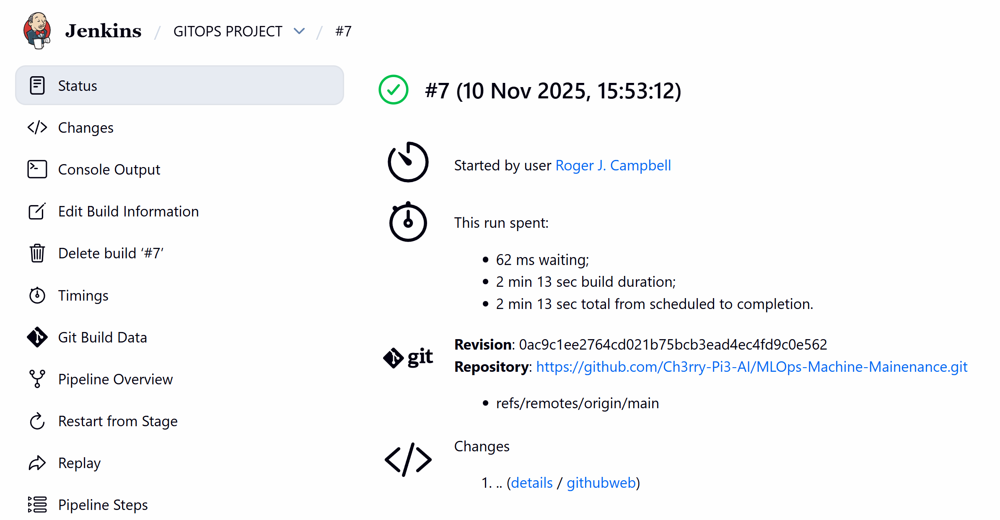
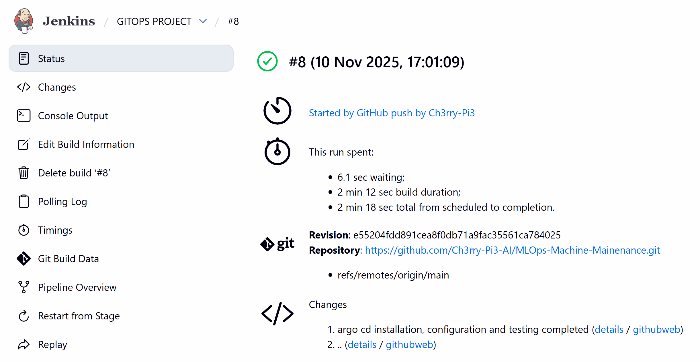

# 🔔 **Webhooks — Automating CI/CD Trigger with GitHub and Jenkins**

Congratulations — you’ve reached the **final stage** of the **MLOps Machine Maintenance** project!
Until now, each time you updated your source code in GitHub, you had to manually log in to Jenkins, start the pipeline, and trigger your ArgoCD deployment.

In this final stage, you’ll implement **GitHub Webhooks**, allowing your **CI/CD pipeline to run automatically** every time you push code to GitHub — achieving full automation.


## 🧩 **1️⃣ What Webhooks Do**

Webhooks act as an **automatic trigger** between GitHub and Jenkins.
Whenever you push new commits to your GitHub repository, GitHub immediately sends a **payload notification** to Jenkins.
Jenkins then starts your pipeline automatically — no manual clicks needed!


## ⚙️ **2️⃣ Configure a Webhook in GitHub**

1. Open your **GitHub repository**.
2. Go to the top-right corner and click **Settings**.
3. In the left pane, select **Webhooks**.
4. Click **Add webhook**.

In the **Payload URL** field, enter your Jenkins external IP followed by `github-webhook/`.
For example:

```
http://34.9.140.201:8080/github-webhook/
```

**Content type:** `application/json`

<p align="center">
  
</p>

Then click **Add Webhook**.


## 🧠 **3️⃣ Configure Jenkins to Respond to Webhooks**

1. Open your **Jenkins Dashboard**.
2. Select your **pipeline project** (e.g., *GITOPS PROJECT*).
3. Click **Configure** in the left pane.
4. Scroll down to the **Build Triggers** section.
5. Check the box for:

```
GitHub hook trigger for GITScm polling
```

<p align="center">
  
</p>

6. Click **Apply** and then **Save**.

Now, Jenkins will automatically listen for push events from your GitHub repository.


## 🔄 **4️⃣ Test Your Webhook Integration**

Let’s confirm everything is connected correctly.

1. Open your local **VS Code project**.
2. Make a small, harmless change to your code — for example, edit a comment or add a blank line.
3. Commit and push the change to your **main** branch:

```bash
git add .
git commit -m "Testing Webhook Trigger"
git push origin main
```

Now, go to your **Jenkins Dashboard**.
You should see your pipeline **start running automatically** — without you pressing *Build Now*.


## 👀 **5️⃣ Verify Who Triggered the Build**

Previously, when you triggered a pipeline manually, Jenkins showed:

<p align="center">
  
</p>

It displayed **“Started by user [Jenkins user]”**.

Now, check the automatically triggered build.
Click on the build number and view the build details — it should display:

<p align="center">
  
</p>

✅ You’ll see **“Started by GitHub push by [your GitHub username]”**.
This confirms your webhook is successfully connected, and Jenkins is responding automatically to GitHub events.


## 🎯 **6️⃣ What You’ve Achieved**

By setting up webhooks, you’ve created a **fully automated CI/CD pipeline**:

1. Push code to GitHub
2. GitHub sends a Webhook to Jenkins
3. Jenkins builds and pushes the Docker image
4. ArgoCD automatically detects changes and deploys to Kubernetes
5. The live Flask app updates seamlessly

No manual intervention required — **true GitOps automation!**


## 🧹 **7️⃣ Cleanup (Optional)**

When you’re finished testing or want to shut down your environment:
Go to your **Google Cloud Console → Compute Engine → VM Instances**, and stop or delete your VM to free resources.


## ✅ **Project Complete!**

You’ve successfully built an **end-to-end MLOps pipeline** featuring:

* **Data ingestion → Model training → CI/CD automation**
* **Docker & Kubernetes orchestration**
* **Continuous Deployment with ArgoCD**
* **Automatic build triggers using GitHub Webhooks**

Your **MLOps Machine Maintenance** project is now a **fully automated, production-ready pipeline** from code commit to live deployment. 🎉